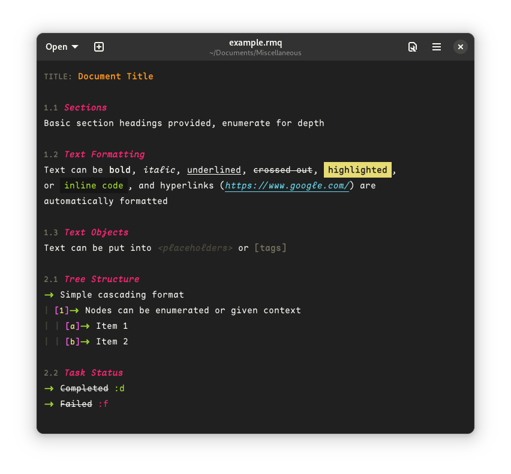

# Remarqué

Remarque is a tree-based note-taking language. Its usefulness lies more in its structure than any syntax highlighting, so a particularly zen user might consider this non-essential (and it is, really). 


## Syntax

Everything below (except text formatting) works without any special language and highlighting support.

* ### Headings

    * #### Heading
        
        ```
        HEADING
        =======
        ```

    * #### Subheading
        
        ```
        Subheading
        ----------
        ```
	
	Headings should be followed by one empty newline, and Subheadings should be spaced by two empty newlines. They don't have to be, they just tend to look better that way.
	
* ### Tree

    ```
    |-> Level 1
    | -> Level 2
    | |-> Level 3
    | | -> Level 4
    | | |-> Level 5
    | | | -> Level 6
    | | | |-> And so on...
    ```
* ### Enumeration

    ```
    |-> Heading
    |1-> Item
    |2-> Item
    |3-> Item
    ```

* ### Banners / Notes / Comments

    ```
    |-> Some text <=|Banner/note/comment
    ```

* ### Todo

    ```
    |-> Item 1 (to do)
    |=> Item 2 (doing)
    |-> Item 3 (done) ✔ <=|This symbol exactly
    ```

* ### Objects
        
    ```
    |-> Items can be indexed [1.1]
    | -> Like so [1.1.1]
    | -> And placeholders are defined as: <placeholder> [1.1.2]
    |
    | -> To Do [1.1.3]
    | |-> <none> [1.1.3.1]
    ```

* ### Text Formatting

    ```
    |-> Text can be:
    |1-> **Bold**
    |2-> *Italic*
    ```


## Syntax Formatting Installation & Usage

### Gedit

* #### Language

    ```bash
    git clone https://github.com/Positron11/remarque.git && cd remarque
    sudo cp Gedit/remarque.lang /usr/share/gtksourceview-4/language-specs/
    sudo chmod 0644 /usr/share/gtksourceview-4/language-specs/remarque.lang
    ```

* #### Color Scheme

    Because of Remarqué's styling, you'll need to use a color scheme that supports Remarqué. At present, the only such schemes are the **[Agenwulf](https://github.com/Positron11/agenwulf-color-scheme)** color schemes (as shown in the example image - available in light and dark mode, and they're not bad too - check them out), but you can easily add Remarqué support to your favourite color schemes like so:

    1. Find your preferred scheme's `.xml` file
    2. Add the following between the `<style-scheme>` tags, and modify values as you'd like:

        ```xml
        <style name="remarque:bold" bold="true"/>
		<style name="remarque:italic" italic="true"/>
		<style name="remarque:tree" foreground="green"/>
		<style name="remarque:enumeration" foreground="pink"/>
		<style name="remarque:current" foreground="yellow" bold="true"/>
		<style name="remarque:done" foreground="green" italic="true"/>
		<style name="remarque:banner" foreground="orange" italic="true"/>
		<style name="remarque:heading" foreground="red"/>
		<style name="remarque:subheading" foreground="red"/>
		<style name="remarque:tag" foreground="comment"/>
		<style name="remarque:placeholder" foreground="weird-gray" italic="true"/>
		<style name="remarque:link" foreground="cyan" underline="true" italic="true"/>
        ```

* #### Font
    
    I recommend that you use a font that has support for programming glyphs, for the best possible UI. Not necessary, but it'll look a lot better. I personally prefer the **[Fira Code](https://github.com/tonsky/FiraCode)** (as shown in the example image).


## To Do

As of now, Remarqué only works on Gedit, but I plan on making it available on other platforms such (Visual Studio Code, Atom, Sublime Text, etc.) later. I only just managed to get it working on Gedit, so if anyone is interested in getting it working on other platforms, see below.


## Contributing
Pull requests are welcome. For major changes, please open an issue first to discuss what you would like to change.

Please make sure to update tests as appropriate.


## License
[MIT](https://choosealicense.com/licenses/mit/)
